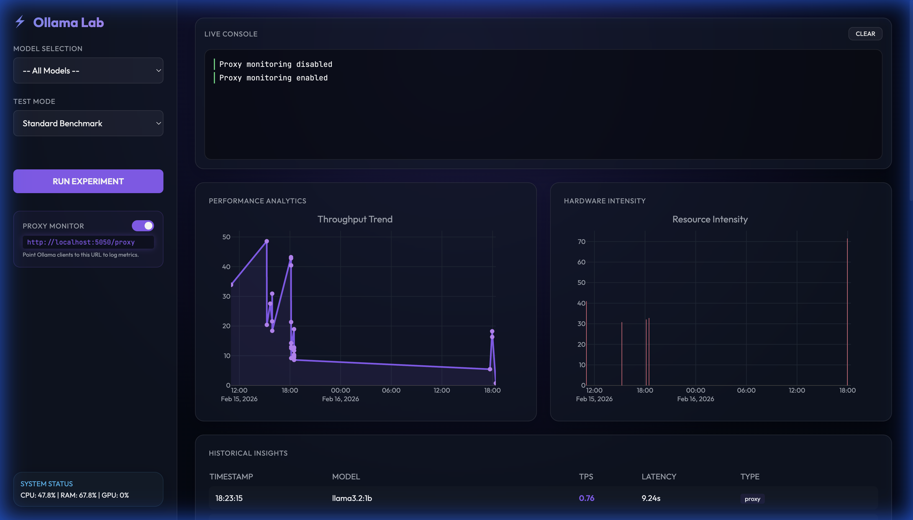
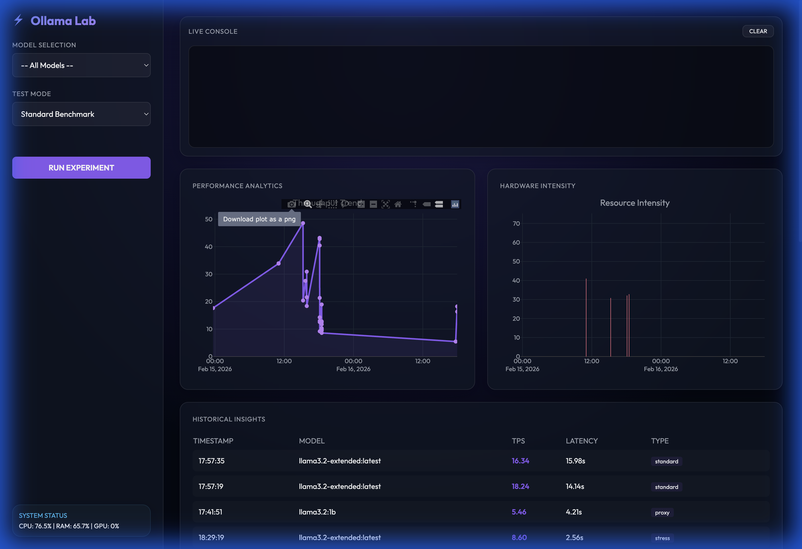
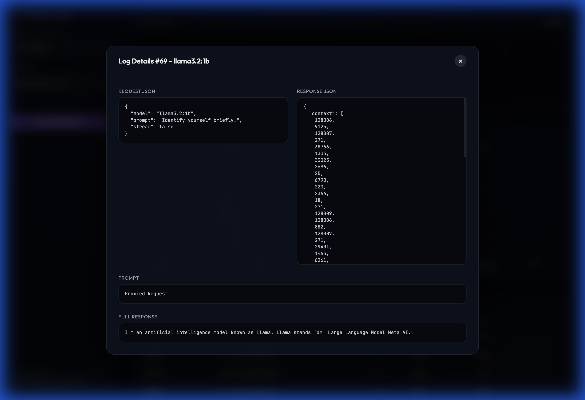

# Ollama Lab (Performance Monitor) 🦙⚡

A premium, standalone benchmarking tool for local LLMs running on Ollama. Track speed, latency, and resource usage with a high-end Web Dashboard.



## Features ✨

- **Ollama Lab Web UI**: Premium glassmorphic dashboard (Dark Mode) for real-time monitoring.
- **Detailed Log Viewer**: Click on history entries to view full Request and Response JSON data.
- **Ollama Proxy Monitoring**: Intercept and log external Ollama API calls in real-time.
- **Real-time Status**: Pulse-animated progress bars and live console logs via WebSockets.
- **Hardware Telemetry**: Live CPU, RAM, and GPU tracking during inference.
- **Advanced Filtering**: Filter historical data by specific models or compare them all at once.
- **Speed & Latency Analytics**: Measures Tokens Per Second (TPS) and consistency across runs.
- **Stress Testing**: Needle in a Haystack (up to 128K context) and Concurrency Load tests.
- **SQLite Persistence**: All results stored in `ollama_performance.db` for long-term analytics.



## Installation 🛠️

1. **Prerequisites**:
   - [Ollama](https://ollama.com/) running.
   - [Python 3.10+](https://www.python.org/).

2. **Clone and Setup**:
   ```bash
   git clone https://github.com/phyrexia/ollama-performance-monitor.git
   cd ollama-performance-monitor
   ```

3. **Install Dependencies**:
   ```bash
   pip install -r requirements.txt
   ```

## Usage 🚀

### 🌐 Web Mode (Recommended)
Launch the premium dashboard:
```bash
python app.py
```
And open **[http://localhost:5050](http://localhost:5050)** in your browser.

### 🕵️‍♂️ Proxy Monitoring
Monitor any application by pointing its Ollama base URL to the proxy:
```bash
# Example: Use the proxy for a generation request
curl http://localhost:5050/proxy/api/generate -d '{"model": "llama3.2:1b", "prompt": "hi"}'
```

### 💻 CLI Mode
Run benchmarks directly from the terminal:
```bash
python ollama_monitor.py
```

## Screenshots 📸

| Log Viewer Detail | Advanced Analytics |
|:---:|:---:|
|  |  |

## Project Structure 📁

- `app.py`: Flask + Socket.IO backend for the Web UI.
- `ollama_monitor.py`: Core benchmarking engine and hardware telemetry.
- `templates/index.html`: Premium dashboard frontend.
- `ollama_performance.db`: Local SQLite database (git-ignored).

## License 📄
MIT License
